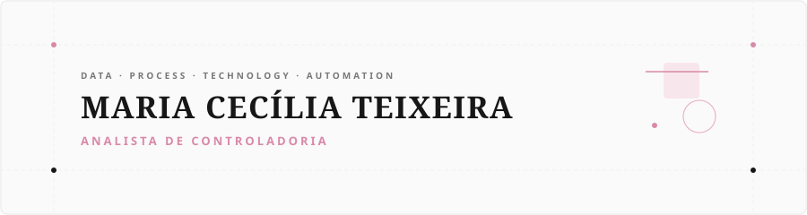
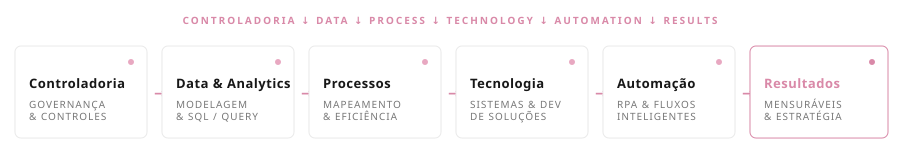
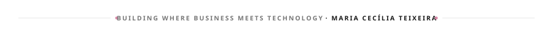

<!-- HERO BANNER -->

 

<!-- TYPING ANIMATION SUBTITLE -->

 

---

### `01 / ABOUT`

Sou **Analista de Controladoria** e tenho uma trajetória profissional pautada pela convergência estratégica entre negócios, dados, processos e tecnologia. Meu foco é atuar diretamente na inteligência operacional, unindo visão analítica de gestão à capacidade técnica de implementação de soluções digitais.

Meu trabalho diário abrange a estruturação de análises financeiras e operacionais, controles internos, acompanhamento de indicadores-chave (KPIs), governança de dados em sistemas corporativos e otimização contínua de processos. Compreendo que a tecnologia deve servir como alavanca estratégica para transformar dados brutos em decisões fundamentadas.

Além da atuação analítica, desenvolvo aplicações e ferramentas customizadas para solucionar gargalos operacionais específicos. Através de automação, modelagem de dados e interfaces web estruturadas, converto necessidades de negócios em fluxos de trabalho organizados, mensuráveis e altamente eficientes.

 

---

### `02 / CURRENTLY`

  

 

---

### `03 / STACK`

 

<table width="100%" stroke="none">
  <tr>
    <td width="50%" valign="top">
      <h4><code>CODE & DEVELOPMENT</code></h4>
      

        
        
        
        
          
        
        
        
        
      

    </td>
    <td width="50%" valign="top">
      <h4><code>DATA & BI</code></h4>
      

        
        
        
        
      

    </td>
  </tr>
  <tr>
    <td width="50%" valign="top">
      <h4><code>ENTERPRISE SYSTEMS</code></h4>
      

        
        
        
      

    </td>
    <td width="50%" valign="top">
      <h4><code>TOOLS & AUTOMATION</code></h4>
      

        
        
        
        
      

    </td>
  </tr>
</table>

 

---

### `04 / SELECTED PROJECTS`

 

<table width="100%">
  <tr>
    <td width="50%" valign="top">
      <h4><strong>EcoPower Insight</strong></h4>
      
Plataforma estratégica para gestão, auditoria contínua, acompanhamento de indicadores de desempenho e refinamento de processos operacionais.

      

        
        
        
        
      

      

        
      

    </td>
    <td width="50%" valign="top">
      <h4><strong>Auditoria Interna EcoPower</strong></h4>
      
Sistema especializado desenvolvido para a organização, execução, monitoramento em tempo real e rastreabilidade de auditorias internas corporativas.

      

        
        
        
      

      

        
      

    </td>
  </tr>
  <tr>
    <td width="50%" valign="top">
      <h4><strong>Portal PO</strong></h4>
      
Solução estruturada para planejamento orçamentário, padronização do preenchimento de Pedidos de Orçamento (PO) e otimização do fluxo de aprovação.

      

        
        
        
      

    </td>
    <td width="50%" valign="top">
      <h4><strong>OperaMind / JORYON</strong></h4>
      
Projeto focado no emprego de Inteligência Artificial e automação avançada de processos para ganhos de escala e eficiência corporativa.

      

        
        
        
      

    </td>
  </tr>
  <tr>
    <td width="50%" valign="top">
      <h4><strong>NF Horwin</strong></h4>
      
Ferramenta voltada ao processamento, validação e estruturação automatizada de dados extraídos de notas fiscais para compliance e controladoria.

      

        
        
        
      

    </td>
    <td width="50%" valign="top">
      <!-- Empty Cell for Editorial Balance -->
    </td>
  </tr>
</table>

 

---

### `05 / GITHUB ACTIVITY`

 

  
  &nbsp;&nbsp;
  

 

---

### `06 / ACTIVITY GRAPH`

 

  

 

---

### `07 / TROPHIES`

 

  

 

---

### `08 / CONTRIBUTIONS`

 

  

 

---

### `09 / CONNECT`

 

&nbsp;&nbsp;&nbsp;&nbsp;

&nbsp;&nbsp;&nbsp;&nbsp;

 

---

<!-- FOOTER -->

 

